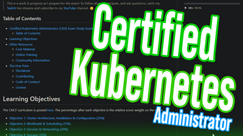

# Certified Kubernetes Administrator (CKA) Exam Study Guide

👋🙂 Welcome!

This repository contains a study guide created in preparation for passing the Certified Kubernetes Administrator (CKA) exam. All of the content found here was livestreamed on [Twitch](https://www.twitch.tv/wahlnetwork) in collaboration with viewers.

Each [Exam Objective](#exam-objectives) is broken down into helpful links, commands, videos, scripts, code samples, and more so that you can refer back to this guide during your studies. Everything here is open source and made by a community of inclusive and friendly folks. If you found this project helpful, why not give us a 🌟star🌟 to help increase awareness!

- [Certified Kubernetes Administrator (CKA) Exam Study Guide](#certified-kubernetes-administrator-cka-exam-study-guide)
  - [Project Overview](#project-overview)
  - [Exam Objectives](#exam-objectives)
  - [Resources](#resources)
    - [📝 Official References](#-official-references)
    - [🎓 Online Training](#-online-training)
    - [🛠 Tools](#-tools)
  - [Managed Kubernetes Clusters](#managed-kubernetes-clusters)
    - [🤗 Community](#-community)
  - [The Fine Print](#the-fine-print)
    - [Disclaimer](#disclaimer)
    - [Contributing](#contributing)
    - [Code of Conduct](#code-of-conduct)
    - [License](#license)

## Project Overview

Key things to know:

- Task tracking is contained on [this Trello board](https://bit.ly/2SzlFRr).
- The `main` branch contains all of the finished work.
- The `draft` branch contains work-in-progress that needs to be polished, verified, and formatted.

Additionally, you can watch this brief introduction video below:

## Exam Objectives

The CNCF curriculum is posted [here](https://github.com/cncf/curriculum). The percentage after each objective is the relative score weight on the exam.

- [Objective 1: Cluster Architecture, Installation & Configuration](objectives/objective1.md) ✔
- [Objective 2: Workloads & Scheduling](objectives/objective2.md) ✔
- [Objective 3: Services & Networking](objectives/objective3.md) ✔
- [Objective 4: Storage](objectives/objective4.md) ✔
- [Objective 5: Troubleshooting](objectives/objective5.md) ✔

## Resources

Fantastic resources from around the world, sorted alphabetically.

### 📝 Official References

- [Certified Kubernetes Administrator (CKA) Exam 1.19 Curriculum](https://github.com/cncf/curriculum/blob/master/CKA_Curriculum_v1.19.pdf)
- [Certified Kubernetes Administrator Exam Registration](https://training.linuxfoundation.org/certification/certified-kubernetes-administrator-cka/)
- [Enable kubectl autocompletion](https://kubernetes.io/docs/tasks/tools/install-kubectl/#enable-kubectl-autocompletion)
- [kubectl Cheat Sheet](https://kubernetes.io/docs/reference/kubectl/cheatsheet/)
- [kubectl Reference Docs](https://kubernetes.io/docs/reference/generated/kubectl/kubectl-commands)
- [Linux Foundation's Important Instructions: CKA and CKAD](https://docs.linuxfoundation.org/tc-docs/certification/tips-cka-and-ckad)

### 🎓 Online Training

- [A Cloud Guru's Cloud Native Certified Kubernetes Administrator (CKA) Course](https://acloud.guru/learn/7f5137aa-2d26-4b19-8d8c-025b22667e76)
- [Katacoda - Learn Kubernetes using Interactive Browser-Based Scenarios](https://www.katacoda.com/courses/kubernetes)
- [Pluralsight CKA Learning Path](https://app.pluralsight.com/paths/certificate/certified-kubernetes-administrator) by author [Anthony Nocentino](https://app.pluralsight.com/profile/author/anthony-nocentino)

### 🛠 Tools

- [Kubectl-fzf Autocomplete](https://github.com/bonnefoa/kubectl-fzf)
- [Power tools for kubectl](https://github.com/ahmetb/kubectx)

## Managed Kubernetes Clusters

- Google Kubernetes Engine (GKE)
  - [Creating a GKE Zonal Cluster](https://cloud.google.com/kubernetes-engine/docs/how-to/creating-a-zonal-cluster)
  - [Generating a kubeconfig entry](https://cloud.google.com/kubernetes-engine/docs/how-to/cluster-access-for-kubectl#generate_kubeconfig_entry)

> Read [Configure Access to Multiple Clusters](https://kubernetes.io/docs/tasks/access-application-cluster/configure-access-multiple-clusters/) to switch between different clusters while studying.

### 🤗 Community

- [Best Practices for CKA Exam](https://medium.com/@emreodabas_20110/best-practices-for-cka-exam-9c1e51ea9b29)
- [CKA-Study Guide](https://github.com/David-VTUK/CKA-StudyGuide) by [David-VTUK](https://github.com/David-VTUK)
- [How I passed the CKA (Certified Kubernetes Administrator) Exam](https://medium.com/platformer-blog/how-i-passed-the-cka-certified-kubernetes-administrator-exam-8943aa24d71d)
- [How to pass the New CKA exam released at September 2020](https://medium.com/@krishna.sharma1408/how-to-pass-the-new-cka-exam-released-at-september-2020-e0e014d67f78)
- [Interesting Kubernetes application demos](https://www.virtuallyghetto.com/2020/06/interesting-kubernetes-application-demos.html)
- [Kubernetes the Hard Way - Kelsey Hightower](https://github.com/kelseyhightower/kubernetes-the-hard-way)
- [Kubernetes tools and resources from learnk8s](https://learnk8s.io/kubernetes-resources)
- [Practice Enough With These 150 Questions for the CKAD Exam](https://medium.com/bb-tutorials-and-thoughts/practice-enough-with-these-questions-for-the-ckad-exam-2f42d1228552)
- [Stack Overflow - Questions tagged kubernetes](https://stackoverflow.com/questions/tagged/kubernetes)
- [Walidshaari's Kubernetes-Certified-Administrator Repo](https://github.com/walidshaari/Kubernetes-Certified-Administrator)

## The Fine Print

### Disclaimer

Absolutely nothing in this organization is officially supported and should be used at your own risk.

### Contributing

Contributions via GitHub pull requests are gladly accepted from their original author. Along with any pull requests, please state that the contribution is your original work and that you license the work to the project under the project's open source license. Whether or not you state this explicitly, by submitting any copyrighted material via pull request, email, or other means you agree to license the material under the project's open source license and warrant that you have the legal authority to do so.

### Code of Conduct

All contributors are expected to abide by the [Code of Conduct](https://github.com/WahlNetwork/welcome/blob/master/COC.md).

### License

Every repository in this organization has a license so that you can freely consume, distribute, and modify the content for non-commercial purposes. By default, the [MIT License](https://opensource.org/licenses/MIT) is used.
